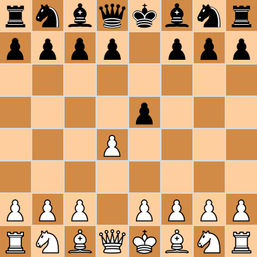

# chess_game

This will have everything you need to play a game of chess.

The current computer algorithm plays a random, legal move each turn.

The game display is both in the terminal and in a non-interactive Tkinter window. The game is played through terminal commands. A GUI is in progress.

To play, run game.py with all five .py files (board.py, chess_utilities.py, game.py, gui.py, and pieces.py) and the assets folder in the same directory.

Next steps:
1. Fix pawn checking king bug. 
2. Test checkmate and stalemate.
3. Option to play competely in a Tkinter GUI.
4. Test that pieces pinned to king should not be able to move.
